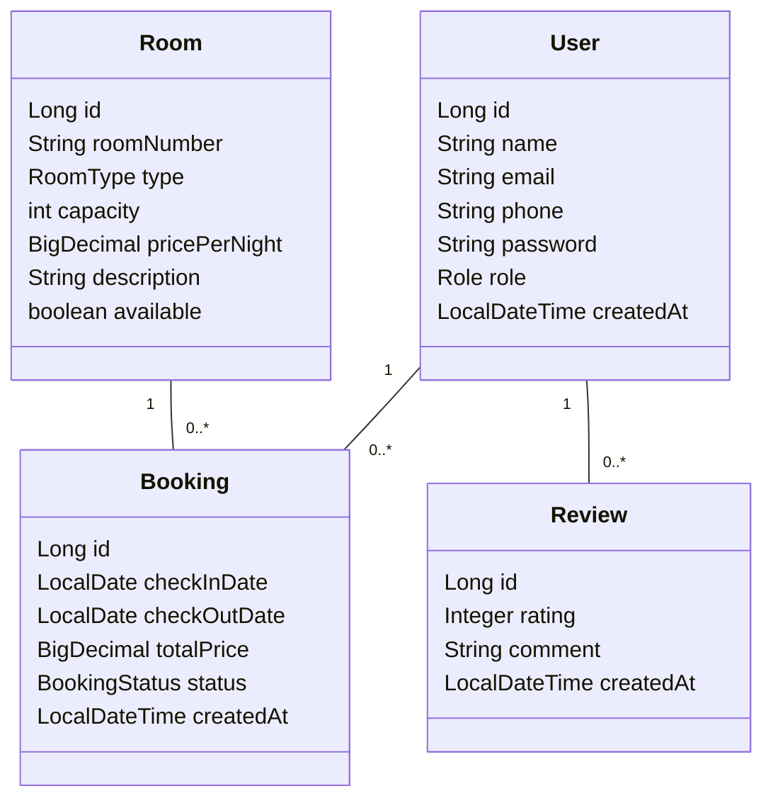
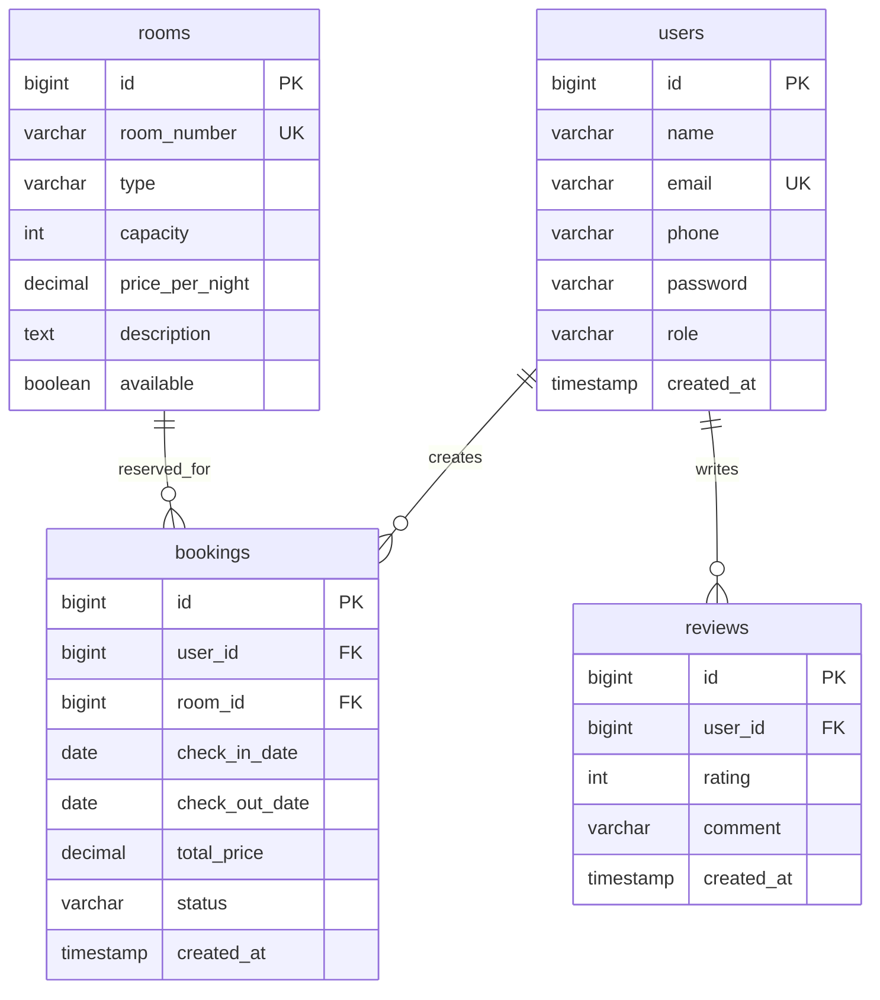
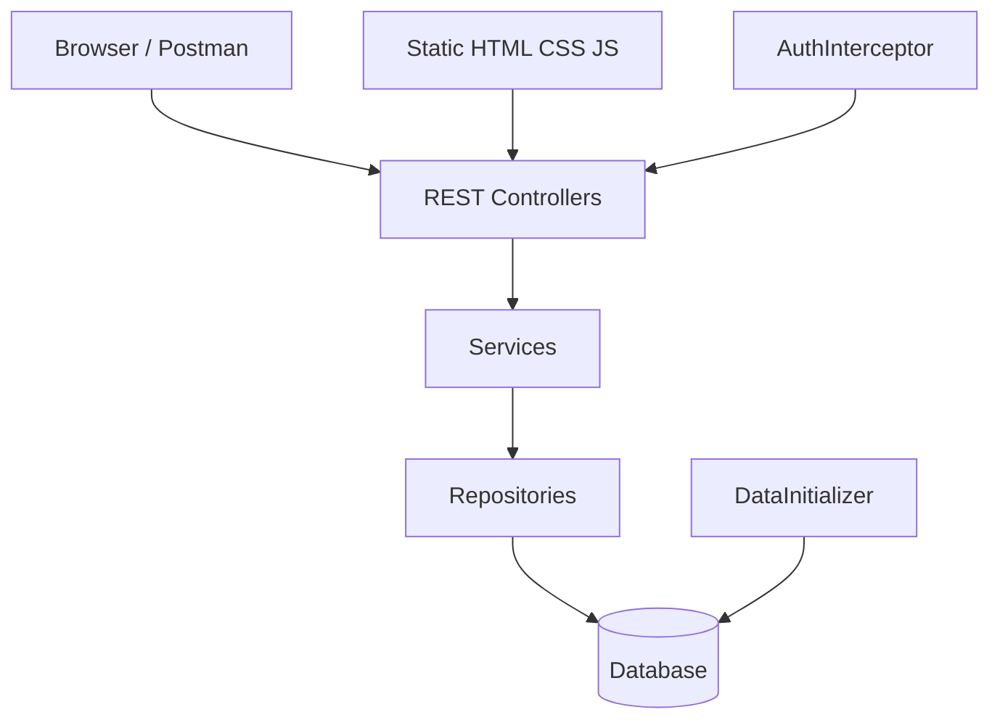
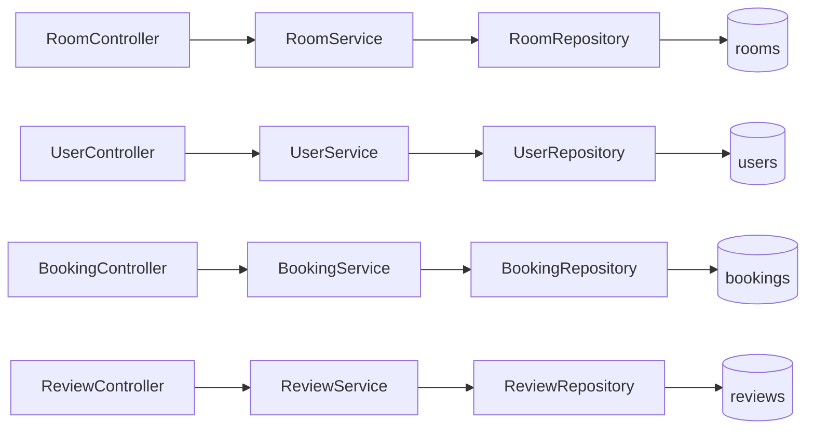

# Диаграммы проекта Hotel Booking System

## 1. UML Class Diagram

```mermaid
classDiagram
class User {
  Long id
  String name
  String email
  String phone
  String password
  Role role
  LocalDateTime createdAt
}
class Room {
  Long id
  String roomNumber
  RoomType type
  int capacity
  BigDecimal pricePerNight
  String description
  boolean available
}
class Booking {
  Long id
  LocalDate checkInDate
  LocalDate checkOutDate
  BigDecimal totalPrice
  BookingStatus status
  LocalDateTime createdAt
}
class Review {
  Long id
  Integer rating
  String comment
  LocalDateTime createdAt
}

User "1" -- "0..*" Booking
Room "1" -- "0..*" Booking
User "1" -- "0..*" Review
```

## 2. Database Schema / ERD

```mermaid
erDiagram
users ||--o{ bookings : creates
rooms ||--o{ bookings : reserved_for
users ||--o{ reviews : writes

users {
  bigint id PK
  varchar name
  varchar email UK
  varchar phone
  varchar password
  varchar role
  timestamp created_at
}
rooms {
  bigint id PK
  varchar room_number UK
  varchar type
  int capacity
  decimal price_per_night
  text description
  boolean available
}
bookings {
  bigint id PK
  bigint user_id FK
  bigint room_id FK
  date check_in_date
  date check_out_date
  decimal total_price
  varchar status
  timestamp created_at
}
reviews {
  bigint id PK
  bigint user_id FK
  int rating
  varchar comment
  timestamp created_at
}
```

## 3. Architecture Diagram

```mermaid
flowchart TD
A[Browser / Postman] --> B[REST Controllers]
B --> C[Services]
C --> D[Repositories]
D --> E[(Database)]
F[Static HTML CSS JS] --> B
G[DataInitializer] --> E
H[AuthInterceptor] --> B
```

## 4. Controller Service Repository

```mermaid
flowchart LR
RoomController --> RoomService --> RoomRepository --> RoomsTable[(rooms)]
UserController --> UserService --> UserRepository --> UsersTable[(users)]
BookingController --> BookingService --> BookingRepository --> BookingsTable[(bookings)]
ReviewController --> ReviewService --> ReviewRepository --> ReviewsTable[(reviews)]
```
